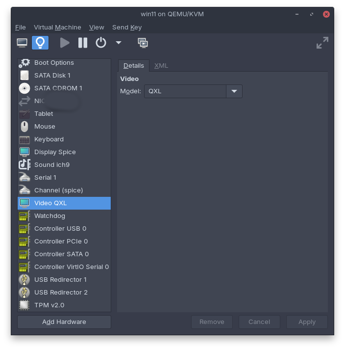

# Fedora 43 Setup Guide

This repository contains instructions to set up Fedora 43 Workstation for developing software in Go, Rust, C# (.NET Core), Java, and other languages.

> See [Pop!_OS Setup Guide](https://github.com/erik1066/pop-os-setup) for a version of this guide specific to Pop!_OS and Ubuntu.


Proceed at your own risk and verify each command before executing that command. If you're unsure what something does, use a search engine or generative AI to ask what the command is doing. 

## Check Fedora Version

Let's make sure we're on Fedora 43, which is the version of Fedora this setup guide is written for:

```bash
cat /etc/fedora-release
```

The terminal output should display `Fedora release 43 (Forty Three)`.

Stop if you get something other than Fedora 43. In that case, this guide may be out-of-date and providing inaccurate information for the version you're using.

## Update the OS

Update Fedora:

```bash
sudo dnf upgrade -y
```

> ⚠️ Reboot the system if the kernal was updated: `sudo reboot`

## Update device firmware

Next, let's check for device firmware updates and install them. Firmware matters for WiFi/Bluetooth performance and battery life. Chances are, your computer has some firmware updates available. Run these commands:

```bash
# See what devices can be updated
sudo fwupdmgr get-devices

# Refresh the firmware database
sudo fwupdmgr refresh --force

# Check for firmware updates
sudo fwupdmgr get-updates

# Apply firmware updates
sudo fwupdmgr update
```

> ⚠️ Reboot the system if updates were applied: `sudo reboot`

## Install common development tools

Let's next install some common development tools:

```bash
sudo dnf -y install make
```

## Optional: Install COSMIC Desktop Environment

Run the subsequent commands if you want the option of using System76's COSMIC desktop environment instead of only having the option of Gnome. 

This code block will reboot your system.

```bash
sudo dnf upgrade --refresh
sudo dnf install @cosmic-desktop-environment
sudo reboot
```

Use the gear icon when logging in to switch to COSMIC.

## Install Gnome Tweaks

Install Gnome Tweaks:

```bash
sudo dnf -y install gnome-tweaks
```

Gnome Tweaks will let you add minimize and maximize buttons to windows, change fonts, modify font rendering behavior, and alter the appearance of the UI.

## Install Tilix

Tilix may be preferable to the default Gnome terminal:

```bash
sudo dnf install tilix
```

## Z Shell (ZSH)

**Instructions derived from https://github.com/ohmyzsh/ohmyzsh/wiki/Installing-ZSH on 2024-09-02**

[ZSH](https://en.wikipedia.org/wiki/Z_shell) can be installed by running:

```bash
sudo dnf install zsh
```

Run `zsh --version` and look for `zsh 5.9 (x86_64-redhat-linux-gnu)` (or newer) to verify success

To set `zsh` as the default shell, run:

```bash
chsh -s $(which zsh)
```

Start a new session. ZSH is now your default shell.

### Optional: Install Oh-My-ZSH for ZSH configuration management
[Oh-My-ZSH](https://github.com/ohmyzsh/ohmyzsh) is an excellent tool for managing your ZSH configuration. Install it using the following command:

```bash
sh -c "$(wget -O- https://raw.githubusercontent.com/ohmyzsh/ohmyzsh/master/tools/install.sh)"
```

An "Oh My Zsh!... is now installed!" message should appear in the terminal output.

> You may be prompted to set ZSH as your default shell.

### Optional: Enable ZSH syntax highlighting
Install syntax highlighting for ZSH by running:

```bash
sudo dnf install zsh-syntax-highlighting
```

Now run:

```bash
echo "source /usr/share/zsh-syntax-highlighting/zsh-syntax-highlighting.zsh" >> ~/.zshrc
```

### Optional: Change ZSH theme using Oh-My-ZSH

Oh-My-ZSH is installed with [several themes](https://github.com/ohmyzsh/ohmyzsh/wiki/Themes). Let's change the default theme to `blinks` by first opening the `.zshrc` file:

```bash
sudo nano ~/.zshrc
```

Find the line `ZSH_THEME="robbyrussell"` and change it to `ZSH_THEME="blinks"` and save. The new theme will be applied to new terminal windows.

### Optional: Enable ZSH plugins

Plugins add functionality to ZSH. Let's enable some [pre-installed plugins](https://github.com/ohmyzsh/ohmyzsh/wiki/Plugins) for a few programming languages. First, open the `.zshrc` file:

```bash
sudo nano ~/.zshrc
```

Find the line `plugins=(git)` and change it to include your preferred plugins. An example:

```
plugins=(git dotnet rust golang mvn npm terraform aws gradle)
```

Save the file. The plugins will be applied to new terminal windows.

## Increase the inotify watch count

When working with certain development tools, you may run into the following error: "User limit of inotify watches reached". The default limit for file watchers is 735,530. Increase this limit to something more reasonable:

1. Run `sudo nano /etc/sysctl.conf`
1. Add `fs.inotify.max_user_watches=10000000` to the bottom of the file
1. Add `fs.inotify.max_user_instances = 256` to the bottom of the file
1. Run `sudo sysctl -p` (or restart the OS)

Increasing the max user instances from 128 to 256 can also help with development debugging experiences.

## Install Zed

**The instructions for installing Zed are derived from https://zed.dev/docs/linux and are current as of 2025-12-25**

Zed is a highly-efficient, cross-platform code editor written in Rust.

Run the following command to install Zed:

```bash
curl -f https://zed.dev/install.sh | sh
```

To run Zed after installation, run:

```bash
zed
```

### Zed from Flathub

You can alternatively install Zed as a Flatpak: https://flathub.org/en/apps/dev.zed.Zed

```bash
flatpak install flathub dev.zed.Zed
```

And then run it as such:

```bash
flatpak run dev.zed.Zed
```

## Obsidian

We'll install the Flatpak version of Obsidian. See https://flathub.org/en/apps/md.obsidian.Obsidian.

```bash
flatpak install flathub md.obsidian.Obsidian
```

If you're unconcerned with security-hardening Obsidian then feel free to skip the following hardening steps. Otherwise, let's start the hardening process by baselining the default permissions:

```bash
flatpak info --show-permissions md.obsidian.Obsidian
```

Optionally, lock down network access:

```bash
flatpak override --user md.obsidian.Obsidian --unshare=network
```

You can also restrict Obsidian from accessing `$HOME`, though we will allow access to specific subfolders in `$HOME` in the next step. The intent is to stop Obsidian from reading sensitive folders in `$HOME` like `~/.ssh`, your financial information, confidential company data, and so on.

```bash
flatpak override --user md.obsidian.Obsidian --nofilesystem=home
```

Below shows how you can whitelist a specific folder in `$HOME` that Obsidian can access. You should replace `Documents/Obsidian` with the folder(s) of your choice. If you want to give Obsidian read-only access to a folder, use `:ro` instead of `:rw`.

```bash
flatpak override --user md.obsidian.Obsidian \
  --filesystem=$HOME/Documents/Obsidian:rw
```

We can safely disable communications that it doesn't need access to. Note, if you want notifications from Obsidian, consider deleting that line below.

```bash
flatpak override --user md.obsidian.Obsidian \
  --nodevice=all \
  --no-talk-name=org.freedesktop.secrets \
  --no-talk-name=org.freedesktop.Notifications
```

Let's explicitly allow only safe portals:

```bash
flatpak override --user md.obsidian.Obsidian \
  --talk-name=org.freedesktop.portal.FileChooser
```

This allows manual "Open file" dialogs but only when you explicitly choose files. Background scanning is thus not possible.

Let's remove some other stuff it doesn't need:

```bash
flatpak override --user md.obsidian.Obsidian \
  --nosocket=ssh-auth \
  --nofilesystem=xdg-run/gnupg \
  --nofilesystem=/mnt \
  --nofilesystem=/media \
  --nofilesystem=/run/media \
  --nofilesystem=xdg-run/app/com.discordapp.Discord
```

Done.


## Install Visual Studio Code

**The instructions for installing Visual Studio Code are derived from https://code.visualstudio.com/docs/setup/linux and are current as of 2025-11-09**

1. Run the following commands:

```bash
sudo rpm --import https://packages.microsoft.com/keys/microsoft.asc
echo -e "[code]\nname=Visual Studio Code\nbaseurl=https://packages.microsoft.com/yumrepos/vscode\nenabled=1\nautorefresh=1\ntype=rpm-md\ngpgcheck=1\ngpgkey=https://packages.microsoft.com/keys/microsoft.asc" | sudo tee /etc/yum.repos.d/vscode.repo > /dev/null
dnf check-update
sudo dnf install code
```

2. Launch Visual Studio Code
1. Navigate **File** > **Preferences** > **Settings** and then type "telemetry"
1. Select "off" for the **Telemetry Level**
1. Disable:
  1. **Telemetry > Edit Stats: Show Decorations**
  1. **Telemetry > Edit Stats: Enabled**
  1. **Telemetry > Edit Stats: Details: Enabled**
  1. **Telemetry > Experimental: Tree Sitter Telemetry**
1. Disable the **"**Dotnet Acquisition Extension: Enable Telemetry**"** option
1. Optional: While still in **Settings**, change the following to "False":
   1. **Enable Natural Language Search**
   1. **Enable Experiments**
1. Optional: While still in **Settings**, enable **Editor: Format on Save**. Turning this setting on is the same as running the **Format Document** command each time you save a file.
1. Optional: While Visual Studio Code is open, select **Activities**, right-click the Visual Studio Code icon on the dock, and select **Add to favorites**.
1. Optional: If you have Docker installed, set **Docker: Lsp: Telemetry** to "off".

The following VS Code extensions are handy:

1. [HashiCorp Terraform](https://marketplace.visualstudio.com/items?itemName=HashiCorp.terraform)
1. [Go](https://marketplace.visualstudio.com/items?itemName=golang.Go)
1. [C# Dev Kit](https://marketplace.visualstudio.com/items?itemName=ms-dotnettools.csdevkit) - syntax highlighting, debugging, test runner support, and intellisense for C#
1. [Rust-Analyzer](https://marketplace.visualstudio.com/items?itemName=rust-lang.rust-analyzer) - Rust language server
1. [CodeLLDB](https://marketplace.visualstudio.com/items?itemName=vadimcn.vscode-lldb) - for debugging Rust code on Ubuntu
1. [Extension Pack for Java](https://marketplace.visualstudio.com/items?itemName=vscjava.vscode-java-pack) - syntax highlighting, debugging, and intellisense for Java, plus unit testing support
1. [Spring Boot Extension Pack](https://marketplace.visualstudio.com/items?itemName=Pivotal.vscode-boot-dev-pack) - specific enhancements for working with Spring Boot
1. [VS Live Share](https://marketplace.visualstudio.com/items?itemName=MS-vsliveshare.vsliveshare) - allows simultaneous editing of code files by multiple authors, like Google Docs
1. [Docker](https://marketplace.visualstudio.com/items?itemName=ms-azuretools.vscode-docker)
1. [Kubernetes](https://marketplace.visualstudio.com/items?itemName=ms-kubernetes-tools.vscode-kubernetes-tools)
1. [JavaScript Debugger for Chrome](https://marketplace.visualstudio.com/items?itemName=msjsdiag.debugger-for-chrome)
1. [Microsoft SQL Server](https://marketplace.visualstudio.com/items?itemName=ms-mssql.mssql)
1. [Python](https://marketplace.visualstudio.com/items?itemName=ms-python.python)
1. [ESLint](https://marketplace.visualstudio.com/items?itemName=dbaeumer.vscode-eslint)
1. [TSLint](https://marketplace.visualstudio.com/items?itemName=ms-vscode.vscode-typescript-tslint-plugin)
1. [Prettier](https://marketplace.visualstudio.com/items?itemName=esbenp.prettier-vscode)
1. [PostgreSQL by Microsoft](https://marketplace.visualstudio.com/items?itemName=ms-ossdata.vscode-pgsql)
1. [YAML by Red Hat](https://marketplace.visualstudio.com/items?itemName=redhat.vscode-yaml)


There are some excellent dark theme alternatives to the VS Code default theme:

1. [Tokyo Night](https://marketplace.visualstudio.com/items?itemName=enkia.tokyo-night)
1. [One Monokai](https://marketplace.visualstudio.com/items?itemName=azemoh.one-monokai)
1. [Atom One Dark](https://marketplace.visualstudio.com/items?itemName=akamud.vscode-theme-onedark)
1. [Material](https://marketplace.visualstudio.com/items?itemName=Equinusocio.vsc-material-theme)
1. [Blueberry Dark](https://marketplace.visualstudio.com/items?itemName=peymanslh.blueberry-dark-theme)
1. [Arc+](https://marketplace.visualstudio.com/items?itemName=ph-hawkins.arc-plus)
1. [Arc Darker](https://marketplace.visualstudio.com/items?itemName=alvesvaren.arc-dark)
1. [Neon City](https://marketplace.visualstudio.com/items?itemName=lakshits11.neon-city)

### Working with VSCode extensions from the terminal

To see which VSCode extensions are installed:

```bash
code --list-extensions
```

You can install VSCode extensions from the terminal, too. Run the following commands to install HashiCorp's Terraform extension, Google's Go extension, Microsoft's Docker extension, and a few others:

```bash
code --install-extension HashiCorp.terraform
code --install-extension golang.Go
code --install-extension ms-azuretools.vscode-docker
code --install-extension vscjava.vscode-java-pack
code --install-extension ms-python.python
code --install-extension ms-dotnettools.csdevkit
code --install-extension ms-mssql.mssql
code --install-extension ms-kubernetes-tools.vscode-kubernetes-tools
code --install-extension redhat.vscode-yaml
```

## Install JetBrains products (Rider, GoLand, IntelliJ IDEA Ultimate, etc)

**The instructions for installing JetBrains products are derived from https://www.jetbrains.com/help/idea/installation-guide.html#toolbox and are current as of 2024-10-08**

1. Visit https://www.jetbrains.com/toolbox/app/ and download the JetBrains Toolbox app.
1. Run the following command, replacing the build number in the script below with the build number of the file name you downloaded:

```bash
tar -xzf jetbrains-toolbox-<build>.tar.gz && cd jetbrains-toolbox-<build> && ./jetbrains-toolbox
```

3. Select the product that you want to install.
4. Pin the Toolbox app to the Dash.

If you want to use remote build/execution environments with your JetBrains products instead of doing that on your Fedora 43 workstation, see [the remote code execution guide](remote-execution.md). This guide walks you through setting a Fedora Server VM on your system that will have your build tools; you'll connect to that VM through JetBrains IDEs via SSH. (This can also apply if you have another physical machine on your network that acts as a remote build machine.)

## Install Postman

Postman is a complete toolchain for API developers.

```bash
flatpak install flathub com.getpostman.Postman
```

## Git configuration

```bash
git config --global user.name "Your Name"
git config --global user.email yourname@yourdomain.com
git config --global init.defaultBranch main
```

See [Customizing Git Configuration](https://www.git-scm.com/book/en/v2/Customizing-Git-Git-Configuration) for more details. You can edit the global Git config file by running `gedit ~/.gitconfig` in a terminal window.

> Tip: Remember that you can include a longer commit message by using a second `-m` in your command. Example: `git commit -m "The short message, best ~50 characters" -m "The extended description that can go on however long you want."`

## SSH Keys for GitHub/GitLab

**The instructions for generating SSH keys is derived from https://docs.github.com/en/authentication/connecting-to-github-with-ssh/generating-a-new-ssh-key-and-adding-it-to-the-ssh-agent. Instructions for adding an SSH key to GitHub is derived from https://docs.github.com/en/authentication/connecting-to-github-with-ssh/adding-a-new-ssh-key-to-your-github-account. Both are current as of 2024-08-29**

1. Run `ssh-keygen -t ed25519 -C "your_email@example.com"`
1. Enter a passphrase
1. Run `ssh-add ~/.ssh/id_ed25519`
1. Run `cat ~/.ssh/id_ed25519.pub`
1. Copy the output from `cat` and paste it into GitLab and GitHub's SSH key sections for your profile
1. Run `ssh -T git@github.com` to [verify the key is recognized and working with GitHub.com](https://help.github.com/en/github/authenticating-to-github/githubs-ssh-key-fingerprints)
1. Run `ssh -T git@gitlab.com` to verify the key is recognized and working with GitLab

## GPG Keys for Signing Commmits and Tags

**The instructions for generating GPG keys is derived from https://docs.github.com/en/authentication/managing-commit-signature-verification/generating-a-new-gpg-key. Instructions for adding a GPG key to GitHub is derived from https://docs.github.com/en/authentication/managing-commit-signature-verification/adding-a-gpg-key-to-your-github-account. Both are current as of 2024-09-12**

1. Run `gpg --full-generate-key`
1. Choose "RSA and RSA (default)"
1. Choose 4096 bits
1. Choose a timeframe of your choice. It's recommended not to set an expiration.
1. When providing an email, it is recommended to use your `noreply@github.com` email address.
1. Provide a secure passphrase.
1. Run:

```bash
gpg --list-secret-keys --keyid-format=long
```

8. From the list of GPG keys, copy the long form of the GPG key ID you'd like to use. E.g. `8FF7C99772967AA3`:
1. Run `gpg --armor --export 8FF7C99772967AA3`, replacing the GPG key ID with the ID produced from step 8.
1. Copy your GPG key, beginning with `-----BEGIN PGP PUBLIC KEY BLOCK-----` and ending with `-----END PGP PUBLIC KEY BLOCK-----`.
1. Add the GPG key to your GitHub account.


## Java

Java is already installed by default on Fedora Workstation. To verify:

```bash
java -version
```

Look for an `openjdk version` message to verify success.

See https://docs.fedoraproject.org/en-US/quick-docs/installing-java/ for installing different versions of Java.

## NodeJS

```bash
sudo dnf install nodejs
```

To verify:

```bash
node -v
npm -v
```

Check for the following outputs:

```
v22.11.0
10.9.0
```

## TypeScript

Once you've installed **NodeJS** using the commands from the prior section, you can install TypeScript into a specific project.

> It's not recommended to install TypeScript globally, though you can via `dnf`.

```bash
# Create a new folder
mkdir typescript-test
cd typescript-test
touch app.ts
nano app.ts
```

Add the following to `app.ts`, :

```ts
let message: string = "Hello, world!";
console.log(message);
```

Back in the terminal session, run:

```bash
npx tsc app.ts
node app.js
```

Look for `Hello, world!` in the terminal output to verify success. If all of the above steps work without producing errors, then TypeScript is successfully installed _at the project level_ in your `typescript-test` folder.


### Project creation using tsc

When in `typescript-test`, we can alternativey run:

```bash
npx tsc --init
```

This command creates a `tsconfig.json` file with `strict` mode turned on by default, which is recommended for new TypeScript projects.

### TypeScript configuration

Remember that `tsconfig.ts` controls important behaviors of TypeScript. Some settings might be desirable for new TypeScript projects:

```json
{
    "compilerOptions": {
        "noImplicitAny": true,
        "strictNullChecks": true
    }
}
```

For example, with `strictNullChecks` set to `true`, this code is invalid:

```ts
const x: number = null;
// invalid; can't assign null to a number type
```

The following code resolves the issue via the addition of `| null` to the type definition:

```ts
const x: number | null = null;
// valid when strictNullChecks is true
```

With `strictNullChecks` turned on we may need to also check for nulls explicity before using object properties, like such:

```ts
if (element) {
  element.textContent = 'Hello, World!';
}
```

> It's recommended to create new projects with `npx tsc --init` which sets the `strict` flag to `true` by default.

### TypeScript debugging in VSCode

To debug TS in VSCode, edit your `tsconfig.json` and ensure `sourceMap` is set to `true`:

```json
{
    "compilerOptions": {
        "noImplicitAny": true,
        "strictNullChecks": true,
		"sourceMap": true
    }
}
```

Run the following command in your terminal session:

```bash
npx tsc
```

Notice there's an `app.js.map` file in addition to `app.js`.

In Visual Studio Code, open the **Run and Debug** pane, set a breakpoint in `app.ts`, and then select **Run and Debug** on the left side of the window. The breakpoint is hit successfully.


## .NET

```bash
sudo dnf install dotnet-sdk-10.0
```

Run `dotnet --list-sdks` and look for the following output to verify success:

```
10.0.102 [/usr/lib64/dotnet/sdk]
```

Opt out of .NET's telemetry:

1. Run `nano ~/.profile`
1. Type `export DOTNET_CLI_TELEMETRY_OPTOUT=true` at the bottom of the file
1. Save and exit
1. Log out and log in again

## Go

**Instructions for installing Go taken from https://go.dev/doc/install on 2024-08-30**

Installing Go can be done using `dnf`:

```bash
sudo dnf install go
```

Using `dnf` will likely install a slightly oudated version of Go. You can alternatively run the following commands to install an up-to-date version of Go. Be sure to replace the version number in the commands below with the version number you want to install. These are the same commands you will use to update Go to a newer version.

```bash
curl -OL https://go.dev/dl/go1.25.6.linux-amd64.tar.gz
sha256sum go1.25.6.linux-amd64.tar.gz
sudo rm -rf /usr/local/go
sudo tar -C /usr/local -xzf go1.25.6.linux-amd64.tar.gz
```

If you are upgrading Go using these commands, then run the following command to verify success:

```bash
go version
```

Look for `go version go1.25.6 linux/amd64` (or newer).

If this is a first-time installation of Go, then running `go version` is likely to display the following output:

```
bash: go: command not found...
Packages providing this file are:
'gcc-go'
'golang-bin'
```

You must set the following environment variables to fix the "command not found" problem after the initial Go installation. _You do not need to repeat this step if you're upgrading an existing Go installation._

```bash
echo "export PATH=$PATH:$(go env GOPATH)/bin:/usr/local/go/bin" >> ~/.profile
source ~/.profile
```

Now run `go version` and you should see the expected version number output to the terminal.

## Terraform

**Instructions for installing Terraform taken from https://developer.hashicorp.com/terraform/install on 2025-11-09**


```bash
wget -O- https://rpm.releases.hashicorp.com/fedora/hashicorp.repo | sudo tee /etc/yum.repos.d/hashicorp.repo
sudo yum list available | grep hashicorp
sudo dnf -y install terraform
```

Run `terraform --version` to verify the installation was a success.

## Podman

**Instructions for installing Podman taken from https://podman.io/docs/installation on 2024-09-02**

Podman is installed by default in Fedora Workstation. To confirm, run:

```bash
podman run hello-world
```

If for some reason you don't have Podman installed you can install it using this command:

```bash
sudo dnf -y install podman
```

## Podman Desktop


Podman Desktop is an open source graphical tool for managing containers locally, much like Docker Desktop. To install:

```bash
flatpak install flathub io.podman_desktop.PodmanDesktop
```

You'll be asked to go through a setup process when running Podman Desktop for the first time. Check all 3 boxes. This will install Podman Compose and `kubectl` system-wide.

## Install Kind and Configure with Podman Desktop

In Podman Desktop, find the "Kind" button on the bottom left of the window and select it. A prompt should appear asking if you want to install Kind. Select Yes. Once completed, open a terminal and run the following command to confirm:

```bash
kind get clusters
```

You should see this output:

```bash
enabling experimental podman provider
No kind clusters found.
```

Back in **Podman Desktop**, go to **Settings** > **Resources** and find the **Kind** tile. Select **Create new...**. Use these settings:

```
Name                       kind-cluster
Provider type:             podman
HTTP port:                 9090
HTTPS port:                9443
Set up ingress controller: Enabled
Node's container image:    (blank)
```

The GUI should display "Successful operation" after a few seconds.

Navigate to the **Kubernetes** tab:


You should see a Kind cluster running as shown in the image above.

Confirm that your Kubernetes context is set to the local Kind cluster:

```bash
kubectl config current-context
```

Observe `kind-kind-cluster` as the output.

## Running common containers

Let's run a Promethus container. We need to use `9091` on the host becase `kind` uses `9090` already.

```bash
podman pull quay.io/prometheus/prometheus
podman run -d -p 9091:9090 quay.io/prometheus/prometheus
```

## Helm

If you followed along with the Podman Desktop installation instructions, you now have a Kubernetes Cluster (via Kind) and `kubectl` installed. Let's now install Helm.

```bash
sudo dnf install helm
```

Run `helm version` to verify success.

## Unity 6 Game Editor

**Instructions for installing Unity Hub taken from https://docs.unity3d.com/hub/manual/InstallHub.html#install-hub-linux on 2024-11-24**

Run the following command to add the Unity Hub repo:

```bash
sudo sh -c 'echo -e "[unityhub]\nname=Unity Hub\nbaseurl=https://hub.unity3d.com/linux/repos/rpm/stable\nenabled=1\ngpgcheck=1\ngpgkey=https://hub.unity3d.com/linux/repos/rpm/stable/repodata/repomd.xml.key\nrepo_gpgcheck=1" > /etc/yum.repos.d/unityhub.repo'
```

Update the package cache and install:

```bash
sudo yum check-update
sudo yum install unityhub
```

You can now run the **Unity Hub** app. Once logged in, select **Install Unity Editor**.

In the **Unity Hub**, be sure to navigate to **Preferences** > **Privacy** and opt out of "Analytics". It is opt-in by default.

> Removing Unity Hub can be done by running `$ sudo yum remove unityhub`

### Fixing SHA1-related license issues in Unity Hub

**Instructions taken from https://discussions.unity.com/t/can-not-activate-license-in-unity-hub-on-fedora-41-rhel9-until-trust-sha-1/1520652/17 on 2024-12-01**

Fedora 41 and later releases no longer allow SHA-1. This means SHA-1-based Unity licenses cannot be activated. Rather than displaying an error, however, the license process in Unity Hub fails without any messages as to why. This can lead users down a long road of troubleshooting things and ultimately wastes time.

Fixing this involves updating Fedora's crypto policies to allow SHA-1, which unfortunately, can be a degradation of system security. Thankfully we can isolate the allowed use of SHA-1 to just Unity Hub:

```bash
sudo update-crypto-policies --set DEFAULT:SHA1
cp /etc/crypto-policies/back-ends/opensslcnf.config ~/my-insecure-unity-opensslcnf.config
sudo update-crypto-policies --set DEFAULT
```

The above commands create a crypto policy config file that allows SHA-1. The default system-wide crypto policy is not permanently altered. You can run Unity with this new policy applied by running:

```bash
OPENSSL_CONF=~/my-insecure-unity-opensslcnf.config unityhub
```

> You _can_ run `sudo update-crypto-policies --set DEFAULT:SHA1` and not deal with the configuration file if you don't mind the security implications.

This section will be updated if and when Unity adopts an algorithm that no longer runs afoul of Fedora's default crypto policies.

## Blender

If we're installing Unity, we probably want Blender, too. 

```bash
flatpak install flathub org.blender.Blender
```

> For Blender, prefer Flathub over Fedora’s Flatpak remote. Fedora’s Flatpak registry is philosophically aligned with Fedora, but Flathub is materially better for Blender in terms of version freshness, completeness, and real-world usability.

Let's get a security baseline on Blender:

```bash
flatpak info --show-permissions org.blender.Blender
```

Expected:

```ini
[Context]
shared=network;ipc;
sockets=x11;wayland;pulseaudio;fallback-x11;
devices=dri;
filesystems=/run/spnav.sock:ro;xdg-config/gtk-4.0:ro;host;

[Environment]
SPNAV_SOCKET=/run/spnav.sock
LD_LIBRARY_PATH=/app/lib:/app/lib/GL/default/lib
AMD_DEBUG=useaco
VK_ICD_FILENAMES=/app/lib/GL/vulkan/icd.d
TMP_DIR=/tmp
TMP=/tmp
```

Let's harden things. We can ensure Blender doesn't have wide-open access to our $HOME directory via user overrides:

```bash
flatpak override --user --nofilesystem=host org.blender.Blender
flatpak override --user --nofilesystem=home org.blender.Blender
```

You can confirm your user-level overrides for Blender exist:

```bash
ls ~/.local/share/flatpak/overrides/
```

You should see an entry from `ls` showing `org.blender.Blender`.

Now let's grant explict permission to your development folder(s):

```bash
flatpak override --user \
  --filesystem=/home/you/dev/source \
  --filesystem=/home/you/dev/assets:ro \
  org.blender.Blender
```

Be sure ot change the `/home/you/dev/...` path to whatever your actual path(s) are that you want to grant permission to.

If you **don't** use online asset browsers, cloud sync, or add-on downloads from inside Blender, then you can disable network access:

```bash
flatpak override --user --unshare=network org.blender.Blender
```

You can also turn network access back on at anytime via:

```bash
flatpak override --user --share=network org.blender.Blender
```

This is aligned with zero-trust security architecture.

Let's do a final audit:

```bash
flatpak info --show-permissions org.blender.Blender
```


## AWS CLI Tools

Fedora has a package for AWS CLI tooling:

```bash
sudo dnf install awscli
```

Run `aws --version` to verify success.

## Azure CLI tools

The simplest way to install the [Azure CLI](https://packages.fedoraproject.org/pkgs/azure-cli/azure-cli/) tools:

```bash
sudo dnf install azure-cli
```

Verify success by running `az --version`. Note that installing via `dnf` will install an older version of the Azure CLI tools.

You cannot run `az upgrade` to upgrade the Azure CLI tools when they were installed using `dnf`.

See [Install Azure CLI on Linux](https://learn.microsoft.com/en-us/cli/azure/install-azure-cli-linux?pivots=dnf) for alternative installation methods that will ensure newer versions are installed.


## Set up and connect to a Microsoft SQL Server

Microsoft SQL Server (MSSQL) can be run in a container instead of installing it locally. We can also start a second container to connect to the first container and run commands.

The advantage in using a second MSSQL container to run SQL commands in the first container is that we don't need to install MSSQL tools on the host machine. Instead, those tools are installed to the second container that we'll use to issue the commands.

Let's get started.

1. Pull the latest MSSQL image:

```bash
podman pull mcr.microsoft.com/mssql/server:2022-latest
```

2. Create the pod that will house our two containers:

```bash
podman pod create --name test-pod-mssql --share net -p 1433:1433
```

3. Next, create and run the main MSSQL container that you want to use as the database server:

```bash
podman run --env "ACCEPT_EULA=Y" --env "MSSQL_SA_PASSWORD=my-secret-pw-12345" --pod test-pod-mssql --name sql1 --hostname sql1 --detach --rm mcr.microsoft.com/mssql/server:2022-latest
```

4. Finally, create the second MSSQL container that you want to use for issuing commands to the first container:

```bash
podman run --pod test-pod-mssql -it --rm --name sql2 mcr.microsoft.com/mssql/server:2022-latest /opt/mssql-tools18/bin/sqlcmd -U sa -S tcp:sql1,1433 -C -P "my-secret-pw-12345"
```

You should see a `1>` prompt after step 3. Type the following commands and press **Enter** to verify success:

```
1> SELECT @@version;
2> GO
```

You will see the following output:

```
------------------------------------------------------------------------------------------------------------------------------------------------------------------------------------------------------------------------------------------------------------------------------------------------------------
Microsoft SQL Server 2022 (RTM-CU17) (KB5048038) - 16.0.4175.1 (X64)
	Dec 13 2024 09:01:53
	Copyright (C) 2022 Microsoft Corporation
	Developer Edition (64-bit) on Linux (Ubuntu 22.04.5 LTS) <X64>

(1 rows affected)
```

5. Use `EXIT` or `QUIT` to terminate the session, which also terminates the 2nd container entirely. You'll still need to tear down the first container.

### Connect to the MSSQL container from a Go program

[Go MSSQL example code](./app-examples/golang-mssql/) is a runnable Go program that should "just work" if you followed the steps above.


### Install Azure Data Studio for Microsoft SQL Server

**Instructions derived from https://learn.microsoft.com/en-us/azure-data-studio/download-azure-data-studio?tabs=linux-install%2Cwin-user-install%2Credhat-install%2Cwindows-uninstall%2Credhat-uninstall#tabpanel_1_linux-install**

Azure Data Studio is a cross-platform alternative to Microsoft SQL Server Management Studio (SSMS). It's absent some key features of SSMS, especially those related to database administration.


Flatpaks or store options to download and install Azure Data Studio are unavailable at the time of writing. We'll use Microsoft's instructions to get it running on Fedora:

1. First, download the [.tar.gz](https://azuredatastudio-update.azurewebsites.net/latest/linux-x64/stable) file.
1. Run the following commands, replacing `<version string>` and `<your username>`.

```bash
cd ~
cp ~/Downloads/azuredatastudio-linux-<version string>.tar.gz ~
tar -xvf ~/azuredatastudio-linux-<version string>.tar.gz
echo 'export PATH="$PATH:/home/<your username>/azuredatastudio-linux-x64"' >> ~/.profile
source ~/.profile
```

3. Run:

```bash
azuredatastudio
```

Or:

```bash
~/azuredatastudio-linux-x64/azuredatastudio
```

4. Turn off telemetry by navigating to **File** > **Preferences** > **Settings** and searching for "Telemetry", then disabling telemetry for all settings that appeear in the search results.


## Set up and connect to a containerized PostgreSQL Server

One can run PostgreSQL in a container rather than installing locally. We can also start a second PostgreSQL container to connect to the first container and run commands.

The advantage to using a second PostgreSQL container to run SQL commands is that we don't need to install PostgreSQL tools locally.

> While Podman and Docker are similar, the rootless nature of Podman containers means the required commands to make container-to-container networking function correctly differ between the two tools. This guide is specific to Podman. Making a similar connection using Docker would require creating a new network in `bridge` mode and setting both containers to use that network, which is not possible in Podman without using rootful containers.

Let's get started.

1. First create a pod:

```bash
podman pod create --name test-pod1 --share net -p 5432:5432
```

2. Next, create and run the main PostgreSQL container that you want to use as the database server:

```bash
podman run --pod test-pod1 --detach --rm --name test-container1 --env POSTGRES_PASSWORD=my-secret-pw postgres:latest
```

3. Finally, create the second PostgreSQL container that you want to use for issuing commands to the first container:

```bash
podman run --pod test-pod1 -it --rm --name test-container2 postgres psql -U postgres -h localhost -p 5432 -d postgres
```

After step 3, you should see a `postgres=#` prompt. Type `SELECT table_name FROM information_schema.tables;` and press **Enter** to verify success. Type `q` to exit the table list view.

> You can always open Podman Desktop to easily delete pods and containers if you mess things up.

### Connect to the PostgreSQL container from a Go program

[Go PostgreSQL example code](./app-examples/golang-postgres/) is a runnable Go program that should "just work" if you followed the steps above.

```go
package main

import (
	"database/sql"
	"fmt"

	_ "github.com/lib/pq"
)

const (
	host     = "localhost"
	port     = 5432
	user     = "postgres"
	password = "my-secret-pw"
	dbname   = "postgres"
)

func main() {
	// connection string
	psqlconn := fmt.Sprintf("host=%s port=%d user=%s password=%s dbname=%s sslmode=disable", host, port, user, password, dbname)

	// open database
	db, err := sql.Open("postgres", psqlconn)
	CheckError(err)

	sql := `SELECT datname FROM pg_database`
	rows, err := db.Query(sql)
	CheckError(err)

	defer rows.Close()
	for rows.Next() {
		var datname string

		err = rows.Scan(&datname)
		CheckError(err)

		fmt.Println(datname)
	}

	// close database
	defer db.Close()

	// check db
	err = db.Ping()
	CheckError(err)

	fmt.Println("Connected!")
}

func CheckError(err error) {
	if err != nil {
		panic(err)
	}
}
```

Let's run the Go code example from the `app-examples` folder in this repository:

```bash
cd ./app-examples/golang-postgres
go get github.com/lib/pq
go run .
```

You should see the following output:

```
postgres
template1
template0
Connected!
```

## Dev Containers

Dev Containers are a way to containerize your development environment. They make your development setup portable and consistent.

However, one thing we must do is configure the Dev Containers VSCode extension to use Podman instead of Docker. This is because the Dev Containers extension assumes you have Docker, but the Fedora Setup guide is using Podman instead. If you've followed along with this guide, how would you go about configuring this?

1. First, get the [Dev Containers](https://marketplace.visualstudio.com/items?itemName=ms-vscode-remote.remote-containers) extension for Visual Studio Code.

1. Open **File** > **Preferences** > **Settings** in Visual Studio Code.

1. Type "Dev Containers" into the **Settings** search box.

1. Change **Dev > Containers: Docker Compose Path** to `podman compose`

1. Change **Dev > Containers: Docker Path** to `podman`

1. Change **Dev > Containers: Docker Socket Path** to `unix:///run/user/1000/podman/podman.sock`.

This is also a good time to update your Docker VSCode extension settings to work with Podman:

7. Type "Docker" into the **Settings** search box.

8. Change **Docker: Docker Path** to `podman`.

9. Change **Docker: Docker Compose Path** to `podman compose`.

10. Add a new environment variable to **Docker: Environment** with item = `DOCKER_HOST` and value = `unix:///run/user/1000/podman/podman.sock`.

Now let's look at an example `devcontainer.json` file that might appear in a repository:

```json
{
	"name": "name here",
	"image": "path-to-image-here",
	"containerUser": "vscode",
	"updateRemoteUserUID": true,
	"containerEnv": {
		"HOME": "/home/vscode"
	},
	"runArgs": [
		"--userns=keep-id:uid=1000,gid=1000"
	]
}
```

Setting `containerUser` to "vscode" ensures that the container uses the `vscode` user to create workspaces. Otherwise, the container might try to create workspaces under `/root`, which will fail in Podman.

This ensures that the `vscode` user is really mapped inside of the container, and it also ensures that `vscode`'s HOME is set explicitly.

> You may still run into trouble with DevContainers using these steps above. Most DevContainer examples assume you're running rootful containers under Docker and _not_ rootless containers in Podman.

## KVM + QEMU + VirtManager

**Instructions derived from https://docs.fedoraproject.org/en-US/quick-docs/virtualization-getting-started/ and https://fedoramagazine.org/full-virtualization-system-on-fedora-workstation-30/**

We can use Linux's built-in Kernel Virtual Machine (KVM) plus QEMU and VirtManager to build, run, and manage VMs.

```bash
sudo dnf install @virtualization
```

Now start the service:

```bash
sudo systemctl start libvirtd
```

Start the service on boot by running:

```bash
sudo systemctl enable libvirtd
```

Verify success by looking for `kvm_intel` or `kvm_amd` in the following:

```bash
lsmod | grep kvm
```

You'll want to administer `libvirt` with the regular user. Otherwise, every time you start `virt-manager` you will need to do so with `sudo` and enter your password.

```bash
sudo usermod -a -G libvirt $(whoami)
```

Now log out and log in again.

### Create a new VM using `virt-manager`
1. Download the [Fedora Silverblue](https://fedoraproject.org/atomic-desktops/silverblue/download/) ISO or the ISO of your choice
1. Place the `.iso` file into the `/var/lib/libvirt/images` folder:

```bash
cd ~/Downloads
sudo mv Fedora-Silverblue-ostree-x86_64-43-1.6.iso /var/lib/libvirt/images
```

3. Open the **Virtual Machine Manager** (aka `virt-manager`)
1. Add a new virtual machine. Note that if you get a connection error, you should reboot your machine.
1. Select **Local install media** and then **Forward**. Step 2 of 5 appears.
1. Select **Browse**. The ISO you copied into the `/var/lib/libvirt/images` folder should appear.
1. Select the ISO and choose **Choose Volume**
1. You  may need to select an operating system. if Virtual Machine Manager couldn't auto-detect one based on the ISO. In our case, using Fedora Silverblue, "Fedora Silverblue 43" is auto-detected and we can skip manual OS selection.
1. Select **Forward**
1. Choose at least "8192" for memory and 2 CPUs and then select **Forward**
1. Choose at least 25 GB of disk storage and select **Forward**
1. Use a distinctive name for the VM and select **Finish**
1. The VM should start automatically. Go through the VM setup process.

### Adjusting screen size

On 4K monitors the VM image may be tiny. You can use a `virt-manager` setting to try and adjust this:

1. Select **View**
1. Select **Scale Display**
1. Check the box titled **Auto resize VM with window**.

### Taking snapshots

Snapshots can be taken in `virt-manager` just like in Virtual Box. You must navigate into the VM window (not the Virtual Machine Manager window) and select the Manage VM Snapshots icon at the far right of the toolbar.

The button to create a snapshot is the **+** (plus) symbol on the bottom left of the window.

### Windows 11 Virtual Machines and screen resolution

There's a potential problem when running Windows 11 VMs in QEMU/KVM: The screen resolution is locked to 1280x800. The solution is to install the Spice Guest Tools for Windows. To do this, open your Windows 11 guest in QEMU/KVM and navigate to https://www.spice-space.org/download.html. Under **Windows binaries**, select "Windows SPICE Guest Tools (spice-guest-tools)" to download the `.exe` file and then run it. A reboot is required. Screen resolution will subsequently be modifiable.

It's important to ensure that the Windows 11 VM properties are set to use `QXL` under **Video**.



## Install Firefox

For security purposes, it's better to run Firefox as a Flatpak instead of from RPM. Flatpak uses bubblewrap for namespace isolation (mount, PID, network options, etc.) and provides a strong default sandbox at low effort. 

First, install Firefox from Flathub:

```bash
flatpak install flathub org.mozilla.firefox
```

Confirm installation by running:

```bash
flatpak list | grep -i firefox
```

You should see output like such:

```
Firefox	org.mozilla.firefox	146.0.1	stable	flathub	system
```

You will have "two" Firefoxes on your system after this: The one from Flathub and the one installed by default. Make sure the Flathub installation of Firefox is the OS's default browser:

```bash
xdg-settings set default-web-browser org.mozilla.firefox.desktop
```

Verify:

```bash
xdg-settings get default-web-browser
```

Expected:

```
org.mozilla.firefox.desktop
```

The simplest next step is to simply uninstall the RPM Firefox:

```bash
sudo dnf remove firefox
```

However, we could instead make the `firefox` command launch the Flatpak. Typing `which firefox` in a terminal should display: `/usr/bin/firefox`. 

Let's override this.

```bash
mkdir -p ~/.local/bin
cat <<'EOF' > ~/.local/bin/firefox
#!/usr/bin/env bash
exec flatpak run org.mozilla.firefox "$@"
EOF
chmod +x ~/.local/bin/firefox
```

Log out and in again. Starting Firefox from Gnome or COSMIC should start the Flathub version instead of the RPM version.

## Configure Firefox

See https://wiki.mozilla.org/Privacy/Privacy_Task_Force/firefox_about_config_privacy_tweeks for advanced privacy-related Firefox configuration options.

This Setup Guide does _not_ list all the options on the site above. It's recommended you visit that site and decide on each option for yourself. However, a few privacy tweaks are important enough that they are worth mentioning here.

Open `about:config` in your Firefox URL bar and accept the warning to proceed with making these privacy tweaks.

```
dom.private-attribution.submission.enabled = false
```

Attribution is a way to track whether ads served to you were effective in getting you to buy something. More information is available at https://github.com/mozilla/explainers/tree/main/ppa-experiment. The above command disables this feature.

```
privacy.resistFingerprinting = true
```

This setting improves your defenses against [browser fingerprinting](https://coveryourtracks.eff.org/learn).

```
dom.event.clipboardevents.enabled = false
```

This setting prevents websites from knowing if you used copy or paste commands and what part of the page you had selected when you used those commands.

```
webgl.disabled = true
```

This command disables WebGL. If you never visit sites with WebGL content then it can be safely disabled.

## Thunderbird

This guide will cover what is assumed to be the most common mail client for Linux: Thunderbird. Know that Thunderbird comes pre-installed in Fedora 43. The first thing to do is uninstall it, since we'll be proceeding with [the Flatpak version of Thunderbird](https://flathub.org/en/apps/org.mozilla.Thunderbird) instead.

```bash
sudo dnf remove thunderbird
```

Now let's install the [Flatpak](https://flathub.org/en/apps/org.mozilla.Thunderbird):

```bash
flatpak install flathub org.mozilla.Thunderbird
```

### Set Thunderbird Flathub Permissions

Let's get a baseline of what our permissions are:

```bash
flatpak info --show-permissions org.mozilla.Thunderbird
```

First, let's remove broad access to the home directory:

```bash
flatpak override --user --nofilesystem=home org.mozilla.Thunderbird
```

Now let's allow only access to a specific subfolder in `/Downloads` called `thunderbird`:

```bash
mkdir -p ~/Downloads/thunderbird
flatpak override --user --filesystem=~/Downloads/thunderbird org.mozilla.Thunderbird
```

Remove hardware access:

```bash
flatpak override --user --nodevice=all org.mozilla.Thunderbird
```

This will remove the `devices=all;` line when running `--show-permissions`.

Since we're on Fedora and using Wayland, let's disable X11:

```bash
flatpak override --user --nosocket=x11 org.mozilla.Thunderbird
flatpak override --user --nosocket=fallback-x11 org.mozilla.Thunderbird
```

This prevents keystroke snooping, window scraping, and X11 global input attacks.

Let's now remove audio access, as Thunderbird shouldn't need this (though be careful if you rely on notification sounds to let you know when new mail arrives).

```bash
flatpak override --user --nosocket=pulseaudio org.mozilla.Thunderbird
```

Let's remove access to printing services next. If you do need to print an email, you can save it to disk and print the file from another app.

```bash
flatpak override --user --nosocket=cups org.mozilla.Thunderbird
```

Verify the result:

```bash
flatpak info --show-permissions org.mozilla.Thunderbird
```

User-level overrides are in:

```bash
~/.local/share/flatpak/overrides/org.mozilla.Thunderbird
```

System-wide overrides are in:

```bash
/etc/flatpak/overrides/org.mozilla.Thunderbird
```

As plain-text, INI-style files, they can be diff'd, version controlled, and backed up. Consider putting them into version control.

Since we've created no system-wide overrides, we just have the user-level override. To see those, execute:

```bash
cat ~/.local/share/flatpak/overrides/org.mozilla.Thunderbird
```

It should now look something like this:

```ini
[Context]
filesystems=!home;~/Downloads/thunderbird;
devices=!all;
shared=network;
sockets=!x11;!pulseaudio;!fallback-x11;!cups;
```

### Thunderbird Security/Privacy Settings

Navigate to **Settings** > **Privacy & Security** and:
1. Block remote content in messages
1. Do not allow third-party cookies
1. Tell websites not to sell or share data
1. Disallow Thunderbird to send data to Mozilla

This prevents tracking pixels, IP address leakage, and web-based exploit delivery. This will restrict remote fonts and external CSS and not just images.

> If you want to disable cookies entirely, this could break OAuth2-based auth when you set up an account for the first time.

### Thunderbird Engine Hardening

Now go to `about:config` by navigating to **Settings** > **General** > **Config Editor** (go all the way to the bottom of the page).

Disable Javascript in mail content:

```
javascript.enabled = false
```

> Disabling JavaScript breaks OAuth2-based auth when you set up an account for the first time. Consider disabling JavaScript _after_ account creation. If you see an OAuth2 window popup and immediately close, it's probably because either (a) cookies are disabled or (b) JavaScript is disabled - or perhaps both.

Verify external protocol handlers are disabled:

```
network.protocol-handler.expose-all = false
```

Verify that file:// access from emails is restricted:

```
security.fileuri.strict_origin_policy = true
```

### Thunderbird Attachment Handling

Disable auto-open by navigating to **Settings** > **General** > **Files & Attachments**:

1. Remove default handlers for PDFs, ZIPs, DOCs
1. Always ask where to save files.

Open attachments **manually**, ideally after scanning them.

A good idea is to open attachments in other Flatpak'd apps or a virtual machine.


## Install and Configure USBGuard

> Enabling USBGuard in Fedora 41 may cause the OS to hard-lock on reboot or power off and prevent virtual machines from starting. This section will be updated with more details as they become available.

USBGuard enables you to block USB device access. This is useful for protecting against rogue USB devices (think "BadUSB") by implementing a USB blocklist and USB device policy.

> Warning: Installing USBGuard using the steps below will create a policy that allows only currently-connected USB devices to be usable on the next boot. You can and should review this policy right after installation to ensure you can continue to use your PC. For instance, if you use hardware security keys to login, and they were not inserted at the time of USBGuard's installation, you could be locked out of your system permanently. Be cautious.

Let's install USB Guard:

```bash
sudo dnf install usbguard
```

You should also consider installing the USB viewer app, though this is optional:

```bash
sudo dnf install usbview
```
<!--
```bash
sudo apt install usbguard usbutils udisks2 usbview
``` -->

You can then graphically view USB devices by running:

```bash
usbview
```

Or through either of these terminal commands:

```bash
lsusb
usb-devices | less
```

We now need to start and then stop the USB Guard service to populate the `rules.conf` file:

```bash
sudo systemctl enable usbguard.service --now
sudo systemctl start usbguard.service
sudo systemctl stop usbguard.service
```

Let's now set an initial policy:

```bash
usbguard generate-policy -X -t reject > /etc/usbguard/rules.conf
```

Now let's modify these configuration files. Open a root terminal and navigate to the `usbguard` directory:

```bash
sudo -i
cd /etc/usbguard
ls -laF
```

Look for `rules.conf` and `usbguard-daemon.conf`.

Let's look at the USBGuard policy:

```bash
sudo grep -vE '^#|^$' /etc/usbguard/usbguard-daemon.conf
```

```ini
RuleFile=/etc/usbguard/rules.conf
RuleFolder=/etc/usbguard/rules.d/
ImplicitPolicyTarget=block
PresentDevicePolicy=apply-policy
PresentControllerPolicy=keep
InsertedDevicePolicy=apply-policy
RestoreControllerDeviceState=false
DeviceManagerBackend=uevent
IPCAllowedUsers=root
IPCAllowedGroups=wheel
IPCAccessControlFiles=/etc/usbguard/IPCAccessControl.d/
DeviceRulesWithPort=false
AuditBackend=FileAudit
AuditFilePath=/var/log/usbguard/usbguard-audit.log
HidePII=false
```

See `ImplicitPolicyTarget=block` on line 3. This line tells the daemon how to treat USB devices that fail to match a rule in the policy. Allowed values are `allow`, `block` or `reject`. A policy of `reject` logically removes the device node from the system.

See `PresentDevicePolicy` on line 4. This line tells the daemon how to treat USB devices that are already connected when the daemon starts. Allowed values are `allow`, `block`, `reject`, `keep` (this maintains the state the device is in) or `apply-policy`. The `apply-policy` default simply means to apply the rules to each USB device.

> You can find further documentation at https://usbguard.github.io/documentation/configuration.

Let's look at the default ruleset that was created when we started and then stopped the daemon:

```bash
sudo nano /etc/usbguard/rules.conf
```

You should see that all currently connected devices are listed with `allow` as the permission. If you're on a laptop with no devices connected then the file is likely to be empty.

Let's start the daemon and check to see if it's working:


```bash
sudo systemctl restart usbguard.service
sudo systemctl status usbguard.service
sudo usbguard list-rules
```

You can list all USB devices recognized by the daemon:

```bash
sudo usbguard list-devices
```

You can verify it's working by plugging in a USB device and running:

```bash
lsusb
```

Look for the USB device in the list. It should appear, but it shouldn't work - that is, if you plugged in a USB thumb drive, it shouldn't appear as new storage. Let's confirm by running this command:

```bash
sudo dmesg | grep -i 'authorized'
```

If you see the following message or type of message then USBGuard successfully blocked the device:

```
[xxxxx.xxxxxx] usb x-x.x: Device is not authorized for usage
```

Let's authorize the device. We first need to find the device id and serial number. Run this command to list all the blocked devices:

```bash
sudo usbguard list-devices -b
```

Note the device ID and serial number. You will need these values. Then run the command below. Before doing so, replace the `1234:5678` and `ABCDEF` with the values outputted from the `sudo usbguard list-devices -b` command. Executing this command permanently updates the `rules.conf` with an `allow` rule for that device.

> The `-p` flag is for permanent; leaving it off the command would make this a temporary rule that would not persist across a reboot.

> If your device has no serial number, just leave the serial number empty. Example: `""`

```bash
sudo usbguard allow-device '1234:5678 serial "ABCDEF"' -p
```

Restart the USBGuard service:

```bash
sudo systemctl restart usbguard.service
```

With your device still plugged in, run:

```bash
sudo usbguard list-devices -b
```

If your device does not appear in the list of blocked devices then you've successfully whitelisted it.

## Useful Gnome Keyboard Shortcuts

Lastly, let's cover some useful keyboard shortcuts for Gnome. You can find a full list at https://help.gnome.org/users/gnome-help/stable/shell-keyboard-shortcuts.html.en, but a subset are called out here, especially for those switching from other distros or from Windows.

| Key Combo       | Action                     |
| --------------- | -------------------------- |
| `Super` + `TAB` | Switches between windows, much like `ALT` + `TAB` in Windows. Caveat: If you have multiple windows of the same app (e.g. two Firefox windows), this key combo won't switch between them. You'll need to use the down arrow key to expand the 'Firefox' selection into its list of windows, then use the left/right arrow keys to select the window you want. |
| `ALT` + `ESC`   | Switches between windows in the current workspace. Unlike `Super` + `TAB`, this does switch between different windows for the same app. |
 `Super` + `A`    | Shows the list of applications. |
 `Super` + `L`    | Locks the screen. Same behavior as Windows. |
 `Super` + `V`    | Shows the notification screen, including the calendar. Press again to make it disappear. |
 `ALT` + `F2`     | Run a command. |
 `ALT` + `Prnt Scrn`     | Take a screenshot of the active window. |
 `Shift` + `Prnt Scrn`   | Take a screenshot of a screen area. |

## Install Fonts

The easiest way to install a font is to download it, extract the contents, and then double-click on the `.ttf` file. This opens Gnome Font Viewer. In the Gnome Font Viewer window, select the blue **Install** button to install the font.

Alternatively, fonts can be installed by downloading a font and placing it into a ffont family older inside of `/.local/share/fonts`.

Let's walk through what this would look like. First, download the [Inter font from Google Fonts](https://fonts.google.com/specimen/Inter) to your `/Downloads` folder.

```bash
mkdir -p ~/.local/share/fonts/Inter
cd ~/Downloads
unzip Inter.zip -d Inter/
cp ~/Downloads/Inter-VariableFont_opsz,wght.ttf ~/.local/share/fonts/Inter
```

## Filesystem security Hardening

First, we will set `noexec` on `/tmp`. `/tmp` is world-writable and used by every user, service, and daemon. It's frequently used to store downloaded files, temp scripts, unpacked archives, etc. 

From an attacker's perspective, it's writable without privileges, always present, and almost never locked down, making it an ideal staging area.

```bash
sudo nano /etc/fstab
```

Recommend adding these lines:

```
tmpfs   /tmp      tmpfs   defaults,noexec,nosuid,nodev,seclabel   0  0
tmpfs   /var/tmp  tmpfs   defaults,noexec,nosuid,nodev,seclabel   0  0
```

Fedora Workstation doesn't rely on these folders for normal operations. Modern IDEs, meanwhile, rely on $HOME/.cache, $HOME/.local, or `$XDG_RUNTIME_DIR`.

Let's go back to fstab:

```bash
sudo nano /etc/fstab
```

Recommend adding this lines:

```
/home   ext4   defaults,nosuid,nodev   0  2
```

Setuid binaries in `/home` should never be ligit and device files in `/home` shouldn't exist. But we want to avoid adding `noexec` to `/home` because this will break your IDEs, like JetBrains for example, and will break games you install on the system (e.g. Steam).


Now let's create a configuration file:

```bash
sudo nano /etc/sysctl.d/99-hardening.conf 
```

Add:

```config
# Block kernel pointer leaks 
kernel.kptr_restrict = 2  

# Harden BPF 
kernel.unprivileged_bpf_disabled = 1  

# Disable unprivileged user namespaces (Fedora default is permissive) 
# Note that this breaks container-based workflows, so only uncomment if you do not plan to use containers on this system
# kernel.unprivileged_userns_clone = 0  

# Restrict dmesg 
kernel.dmesg_restrict = 1  

# Protect hardlinks/symlinks 
fs.protected_hardlinks = 1 fs.protected_symlinks = 1  

# ASLR full 
kernel.randomize_va_space = 2
```

`kernel.kptr_restrict = 2` restricts access to kernel pointers, which are sensitive and speak to memory layout of the kernel. A setting of `2` stops even `root` from reading pointer info. Note that Fedora 43's default is `1`.

`kernel.dmesg_restrict = 1` restricts access to the `dmesg` command, which shows kernel ring buffer logs. Attackers can use these logs, which may contain sensitive info about kernel config etc.

`kernel.randomize_va_space = 2` fully enables address space layout randomization (ASLR). Fedora 43's default is `1`, or partial randomization only. A setting of `2` makes it harder for attackers to predict the memory layout of processes. However, this setting can negatively impact certain debugging experiences since memory address are constantly changing and it carries a slight performance overhead. Some legacy software might also not work if that software makes assumptions abot memory layout. Be warned.


Now run:

```bash
sudo sysctl --system
```

This prevents local privilege escalation exploits and kernel info leaks.
